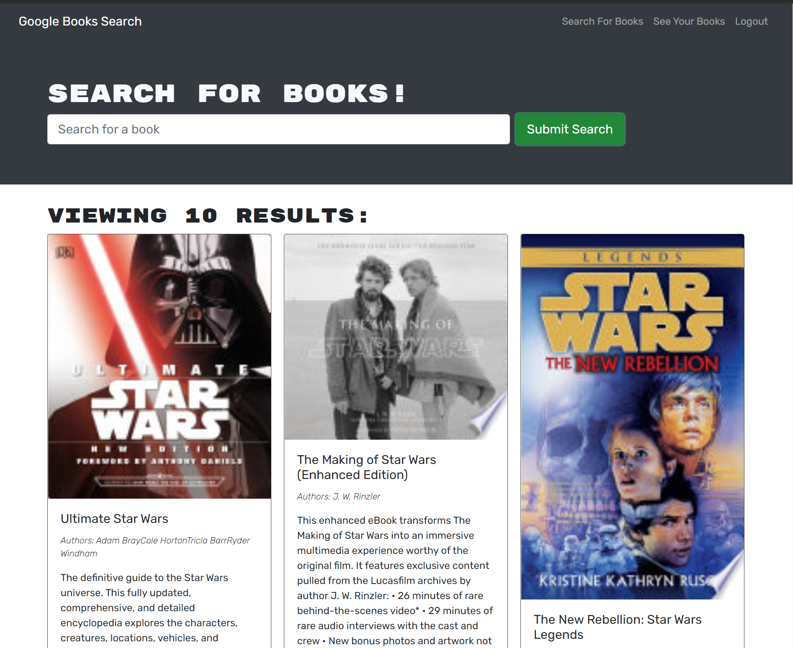

<h1 align="center">MERN-Book-Search-Engine </h1>

Deployed to Heroku <a href="https://obscure-plains-26619.herokuapp.com/">here!</a>

## Description:

I took a fully functioning Google Books API search engine built with a RESTful API, and refactored it to be a GraphQL API built with Apollo Server.  The app was built using the MERN stack, with a React front end, MongoDB database, and Node.js/Express.js server and API. The steps I took to complete the challenge were:

1. Set up an Apollo Server to use GraphQL queries and mutations to fetch and modify data, replacing the existing RESTful API. 

2. Modify the existing authentication middleware so that it works in the context of a GraphQL API.

3. Create an Apollo Provider so that requests can communicate with an Apollo server.

4. Deploy the application to Heroku.

## Local Development

  
* Run `npm init -y` from the command line
* Run `npm i` to install dependencies

## Usage

* Run `npm run develop` to build the app locally in a development environment

### Made with ❤️ by  Brad Dunham

Back to [top of page](# )
